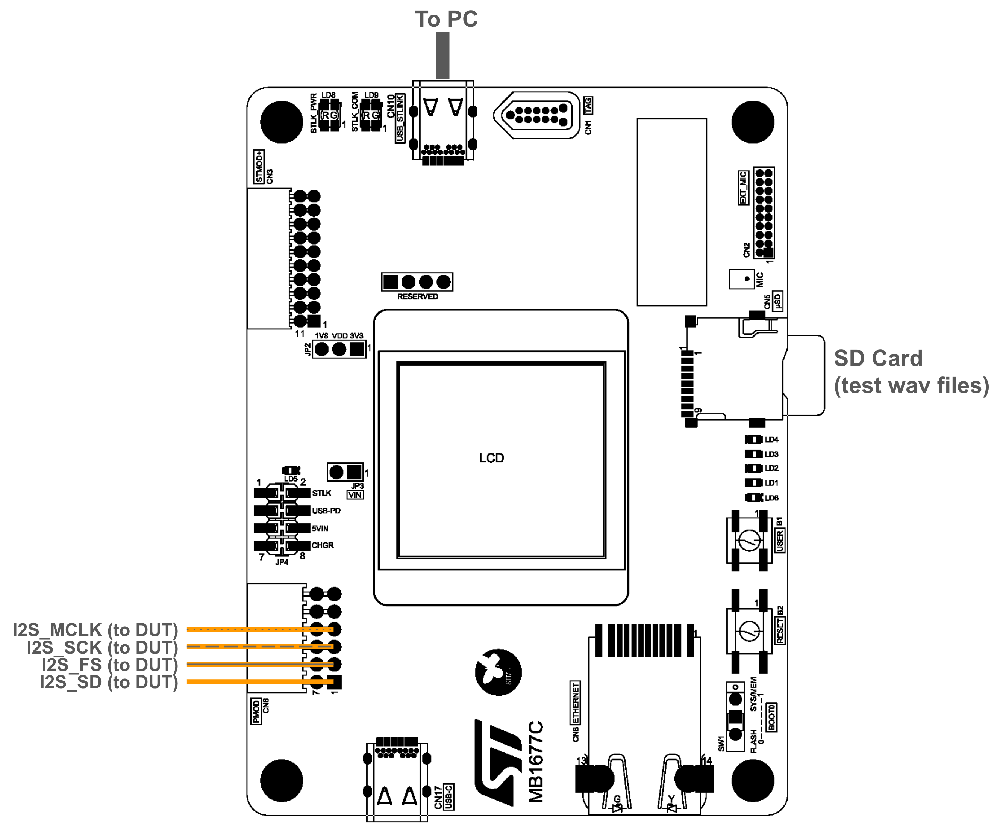
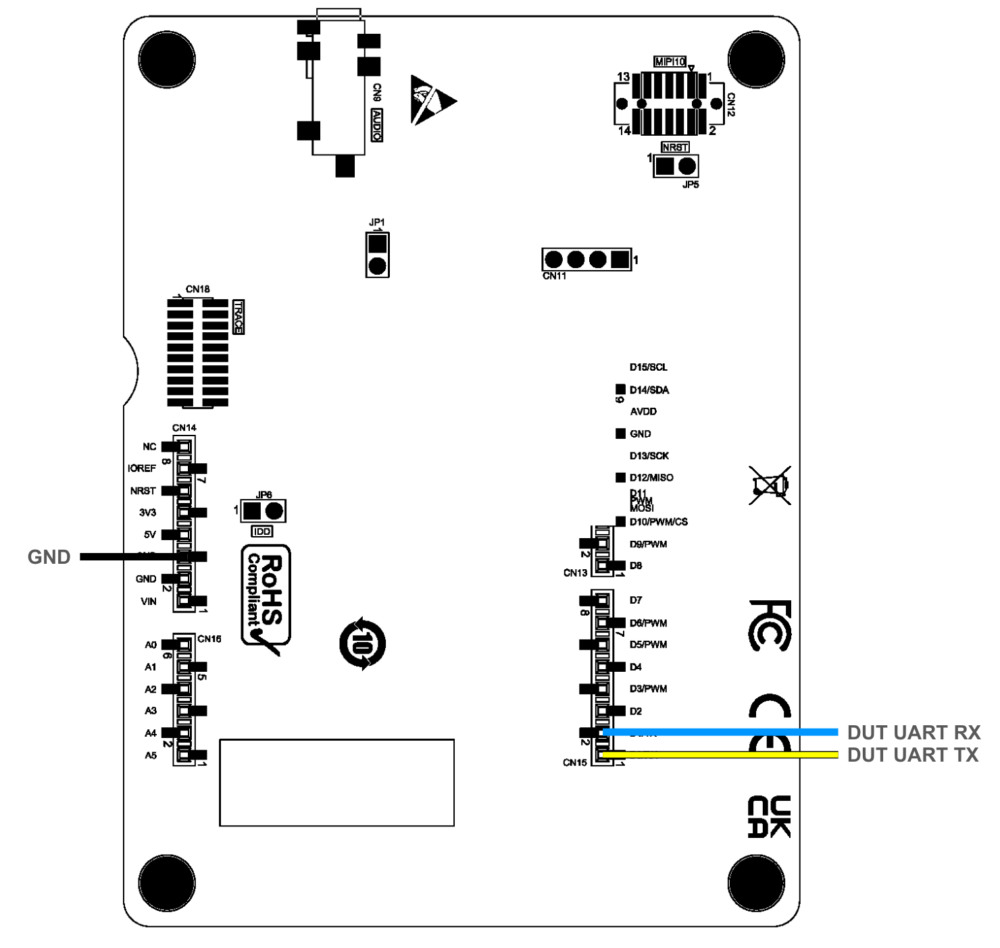
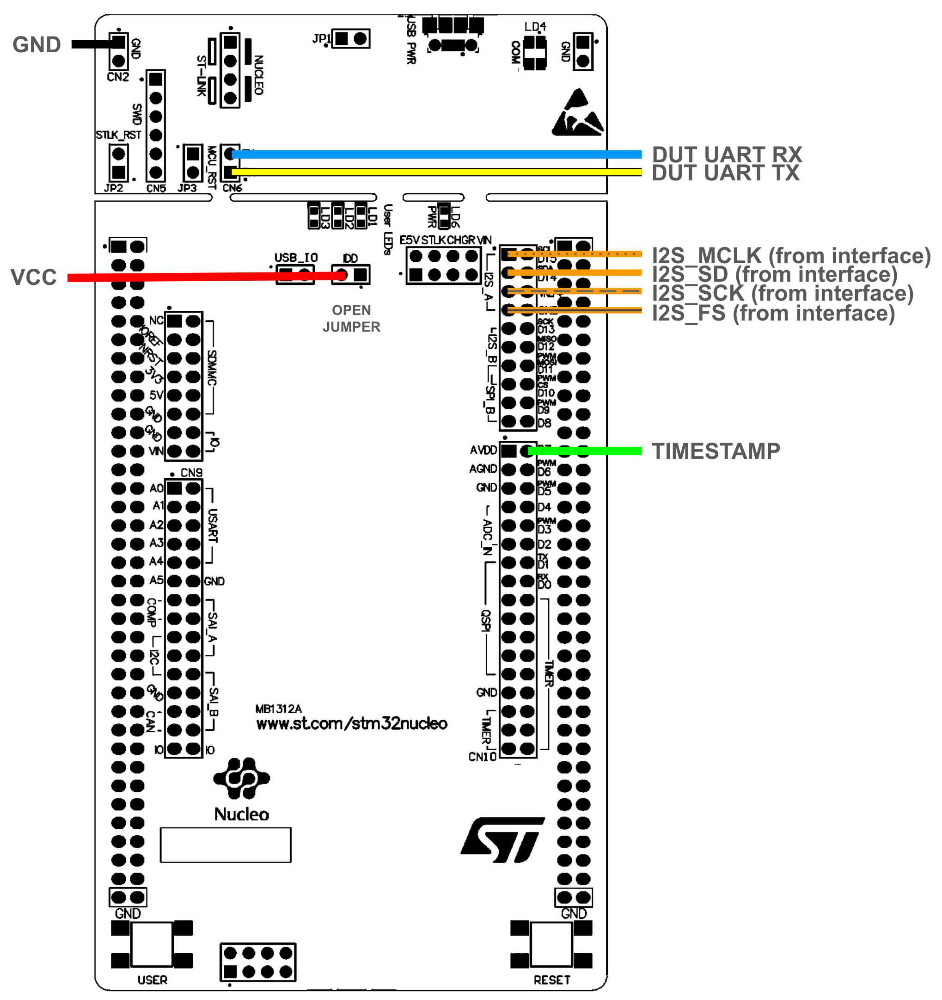

[[_TOC_]]

## Energy Test Connections

### Power Board (LPM01A)

### Interface Board (STM32H573I-DK)


### Device Under Test (L4R5ZI)


## Test Runner
The test runner connects to the interface board and the power board and the dut.  It will execute test scripts.
Test script is determined by the configuration of the hardware.

### Test Scripts `tests.yaml`
#### Example
```yaml
<<model_id>>:
  name: <<test_name>>
  model: <<model_id>>   # the same as above
  truth_file: <<path>> # The path to ground truth values
  script:
    - list
    - of
    - commands
```

#### Syntax

- `download` Download data to the test device
- `loop` Run the commands a number of time
- `infer` Run inference For a number of cycles

### Device Configuration `devices.yaml`
The device file defines available devices that are automatically detected by the `DeviceManager`

#### `name`: The name of the device
#### `type`: the device type (`interface` or `power`)
#### `preference`: The relative importance if two are detected.  Higher numbers are higher preference.
#### `usb`: `dict` where the key is `vid` and the value is a `pid` or list of `pid`s
#### `usb_description`: String to match in the USB description

### Device Under Test Configuration `dut.yml`
Optionally define `baud` and `voltage`

### Contributing -- Getting Started
If you're interested in helping out, great!  Thank you. The first thing to do is to replicate the current state of what is already working.  Roughly speaking, that includes the runner on the host communicating via USB to the interface board (running the code under ../interface), and the interface board communicating to the reference DUT via UART.  You can run a performance test of the KWS benchmark to verify that your setup is working correctly.

1. Compile the KWS reference code for the reference board and load it onto the reference board.  See instructions [here](https://github.com/mlcommons/tiny/tree/master/benchmark/training/keyword_spotting).
2. Compile the interface code and flash it to the interface board.  You can use the STM32 Cube IDE for this.
3. Insert a FAT32-formatted micro-SD card into the interface board.  You can load a few wav files onto the card, but that is not strictly necessary at this point.
4. Inter-board connections.  Leave out the Energy Monitor (LPM01A) for now.  Connect the UART and ground wires between the interface board and the reference DUT, as shown in the figures below.  
    * You can omit the I2S, VCC and Timestamp connections.  
    * Note that the pin labeled "TX" on the reference board is actually the UART RX pin; the diagrams account for this mis-labeling.  
    * The VCC jumper on the reference board(indicated as open in the figure) should actually be closed, since we are not trying to measure supply current.
5. Download or create the bin files for the benchmark you are running.  The KWS files are available at EEMBC's github [here](https://github.com/eembc/energyrunner/tree/main/datasets), but the other ones will need to be created from the original datasets.  The recommended location for the KWS files is `${HOME}/eembc/runner/benchmarks/ulp-mlperf/datasets/kws01`.  The other datasets should be located in ic01, ad01, vww01, under the datasets directory.
6. From the runner directory (this directory), run the following command line. Substitute the location where you put the datasets if you used something different, but the directory 'kws01' should be immediately under whatever you specify for `--dataset_path`.
```python main.py --dataset_path=${HOME}/eembc/runner/benchmarks/ulp-mlperf/datasets/```
7. The `tests.yaml` file currently in the repo (Oct 16, 2024) is configured to loop through the first 10 files in `y_labels.csv`, transmit them to the DUT through the interface board, and run a single inference on each of them.  It is essentially a shortened accuracy run.  You should get an output something like what is shown below.  
    * Anything following a `#` is a comment added after the run, so you won't see that.
    * Line that start with `RX:` are received by the runner from the interface board.  
    * Lines that start with `RX:[dut]:` are received from the DUT, relayed by the interface board.  
    * Most other lines will end with `%` and are echos of what is sent by the runner to the interface board.  
    * Commands from the runner to the interface board that are prefaced with `dut` will be relayed to the DUT.

```Shell
name%  # Ask the interface board to identify itself
RX:tinyML Enhanced Interface Board
# interface board responds with m-ready to indicate that it has completed 
# the last request and is ready for the next one.
RX:m-ready 
dut name% # Ask the DUT to identify itself
RX:m-dut-passthrough(name)
RX:m-ready
RX:[dut]: m-name-dut-[unspecified] # DUT responds with its name
RX:[dut]: m-ready # DUT is ready to receive commands from the interface board
dut profile% # get firmware version and model from the DUT.
RX:m-dut-passthrough(profile)
RX:m-ready
RX:[dut]: m-profile-[ULPMark for tinyML Firmware V0.0.1] # firmware version
RX:[dut]: m-model-[kws01] # model and version
RX:[dut]: m-ready
name%
RX:tinyML Enhanced Interface Board
RX:m-ready
dut db load 490% # begin loading the first input file to the DUT, via the interface board.
RX:m-dut-passthrough(db load 490)
RX:m-ready
RX:[dut]: m-[Expecting 490 bytes]
RX:[dut]: m-ready
dut db 025551514f5152515354005251524f5151515354005553544f515150525100%
RX:m-dut-passthrough(db 025551514f5152515354005251524f5151515354005553544f515150525100)
# several more db statements
RX:m-ready
RX:[dut]: m-ready
dut db 50504f5053195c4e4f4b4e4f4f5252175e514d4b4c50515152%
RX:m-dut-passthrough(db 50504f5053195c4e4f4b4e4f4f5252175e514d4b4c50515152)
RX:m-ready
RX:[dut]: m-load-done
RX:[dut]: m-ready
dut infer 1%
RX:m-dut-passthrough(infer 1)
RX:m-ready
RX:[dut]: m-warmup-start-10
RX:[dut]: m-warmup-done
RX:[dut]: m-infer-start-1
RX:[dut]: m-lap-us-67410227
RX:[dut]: m-lap-us-67565820
RX:[dut]: m-infer-done
RX:[dut]: m-results-[0.000,0.000,0.000,0.000,0.000,0.007,0.000,0.000,0.000,0.000,0.000,0.992]
RX:[dut]: m-ready
dut db load 490%
RX:m-dut-passthrough(db load 490)
RX:m-ready
RX:[dut]: m-[Expecting 490 bytes]
RX:[dut]: m-ready
dut db f8525352545553525453fa515654545252535353f8515453535353505253f9%
RX:m-dut-passthrough(db f8525352545553525453fa515654545252535353f8515453535353505253f9)
RX:m-ready
RX:[dut]: m-ready
# several more db statements
dut db 5152535251fc525351535254545353fb515551535353525251%
RX:m-dut-passthrough(db 5152535251fc525351535254545353fb515551535353525251)
RX:m-ready
RX:[dut]: m-load-done
RX:[dut]: m-ready
dut infer 1%
RX:m-dut-passthrough(infer 1)
RX:m-ready
RX:[dut]: m-warmup-start-10
RX:[dut]: m-warmup-done
RX:[dut]: m-infer-start-1
RX:[dut]: m-lap-us-69516388
RX:[dut]: m-lap-us-69671979
RX:[dut]: m-infer-done
RX:[dut]: m-results-[0.000,0.000,0.000,0.000,0.000,0.570,0.000,0.000,0.000,0.000,0.000,0.429]
RX:[dut]: m-ready
# Several more load/infer cycles.
# Now it prints out the result, which is a list of dicts. 
[{'file': 'tst_000000_Stop_7.bin', 'classes': ' 12', 'class': ' 7', 'infer': {'start_time': 67410227, 'end_time': 67565820, 'results': [0.0, 0.0, 0.0, 0.0, 0.0, 0.007, 0.0, 0.0, 0.0, 0.0, 0.0, 0.992], 'elapsed_time': 155593}}, {'file': 'tst_000001_Left_2.bin', 'classes': ' 12', 'class': ' 2', 'infer': {'start_time': 69516388, 'end_time': 69671979, 'results': [0.0, 0.0, 0.0, 0.0, 0.0, 0.57, 0.0, 0.0, 0.0, 0.0, 0.0, 0.429], 'elapsed_time': 155591}}, 
# several more files worth of results dicts.
{'file': 'tst_000010_Unknown_11.bin', 'classes': ' 12', 'class': ' 11', 'infer': {'start_time': 86368415, 'end_time': 86523996, 'results': [0.0, 0.0, 0.0, 0.0, 0.0, 0.0, 0.0, 0.0, 0.0, 0.0, 0.0, 0.996], 'elapsed_time': 155581}}]
```

## Open Items
* **Basic operation**
  - Write the results out in the original format, similar to what the original runner did.
    - Need to differentiate between accuracy run, performance run, and energy run
  - Verify tests.yaml on AD, IC, VWW benchmarks (only KWS) is tested.
  - Debug file transfer. KWS has random-level accuracy, and I (JH) suspect it is because the files are not 
    being transferred correctly.
* **Energy Measurement**
  - Test with the energy monitor LPM01A.
  - Add support for the JouleScope.
* **Streaming Benchmark**
  - Add start and stop playback to the script. The runner needs to parse the script and send the command and the interface board needs to accept and act on the commmand.
  - Add parsing of window files (e.g. `../training/streaming_wakeword/long_wav_ww_windows.json`) on the interface board.  Interface board should read the json file from the micro SD card, 
  - On the interface board, add detection of strobed GPIO when DUT signals detection, and determination of whether it was a true positive or false positive.
  - After streaming a wav file to the DUT, the interface board should print out the true detections, false detections, and false negatives with timestamps.  Also calculate FAR (FAs/hour) and FRR (percentage).
  - Create a DUT reference implementation of the streaming benchmark, using the L4R5ZI reference board.
    - Probably easist to start from the KWS code and infer on a single static frame of pre-computed features. That input tensor can be included in the code using xxd output, like the TFLite model.
    - Then implement feature extraction on DUT, operating on a single static audio clip.
    - Then iterate with multiple inferences through either a longer audio clip, or a longer sequence of feature frames.
    - Then strobe a GPIO on wakeword detection.
    - Implement I2S ingestion on the DUT.
    - Implement streaming detection using the I2S audio input.
